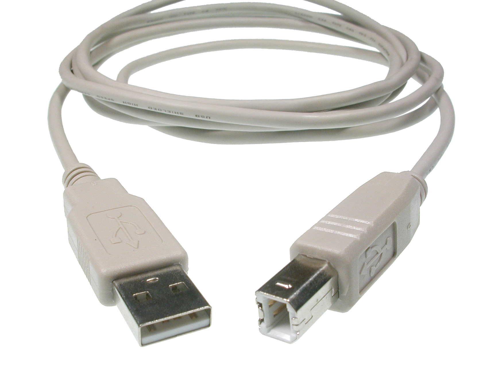

Install Arduino IDE app on your laptop and make sure it runs. Install from [this page](https://www.arduino.cc/en/main/software).

Also make sure you have the cable on your desk as well as the Arduino (ask Slava and Edward for the kit).

