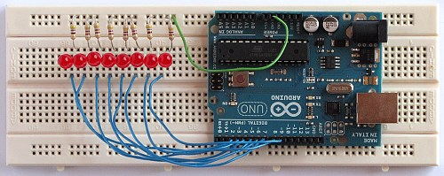
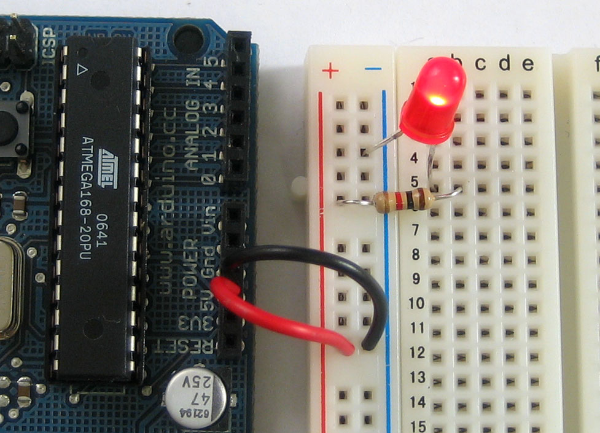

# Arduino Exercises

This is what an Arduino circuit looks like:

Usually, you would connect it to your computer over USB. The USB runs the power and also allows the computer to upload the code to Arduino.

Notice that there are many pins that can be used to connect Arduino and the breadboard. Usually, you would connect 5V power from Arduino pin to the power rail, and the GND pin to the ground rail.

## Step 1

Construct a simple circuit using Arduino just as a power source to power an LED.

Some things to note:

- The LED has two legs. The shorter leg is the "negative leg" and connects to GND (ground)
- The longer leg of LED connects to a resistor
- There are many different transistors, pick the 220 Ohm one. LED would work with a resistor up to 1K Ohm too.
- Pick anything that has stripes: red, red, brown, gold.

Let Slava and Edward know when you are done, or if you need help.

## Step 2

TODO
