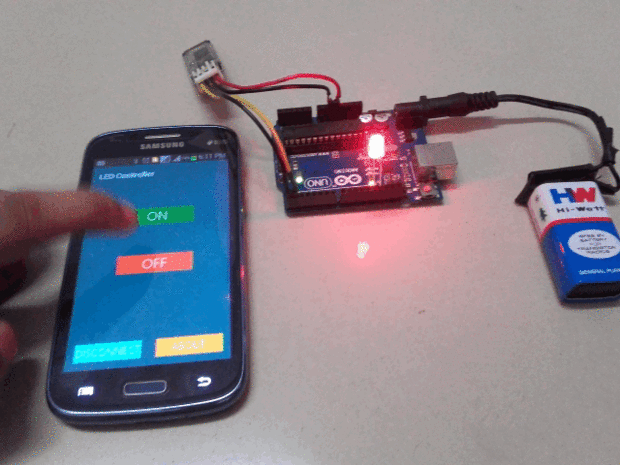
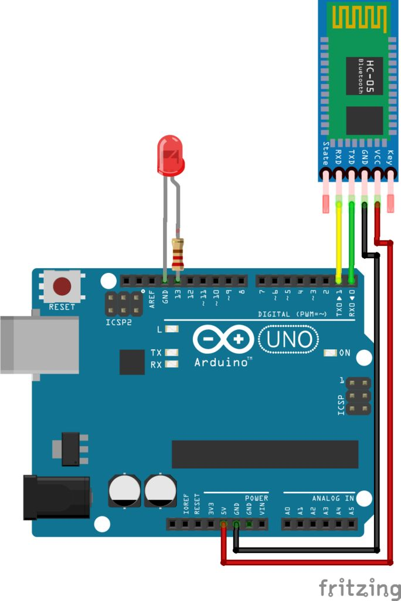

# Arduino Exercises

This is what an Arduino circuit looks like:


Usually, you would connect it to your computer over USB. The USB runs the power and also allows the computer to upload the code to Arduino.

Notice that there are many pins that can be used to connect Arduino and the breadboard. Usually, you would connect 5V power from Arduino pin to the power rail, and the GND pin to the ground rail.

## Step 1

Construct a simple circuit using Arduino just as a power source to power an LED.

Some things to note:

- The LED has two legs. The shorter leg is the "negative leg" and connects to GND (ground)
- The longer leg of LED connects to a resistor
- There are many different resistors, pick the 330 Ohm or higher. LED would work with a resistor up to 3K Ohm too, but it won't be as bright.


Let Slava and Edward know when you are done, or if you need help.

## Step 2

Next we will actually code up the Arduino. The following text is the tutorial of a blinking light circuit driven by Arduino.

See the picture below, use your Arduino's pin 13 as a power source (instead of the 5V pin). Use the wires and the breadboard to connect the components, first.


To write and upload code to Arduino, use the __Arduino IDE app__ that we asked you to install in the beginning of today's workshop. Once you are ready to upload the code, you can use the buttons on the top panel to verify and then upload the code. Make sure your Arduino is always connected to the laptop over USB cable.

For the code, we will use the `LED_BUILTIN` constant to refer to pin 13.

The first thing you do is to initialize `LED_BUILTIN` pin as an output pin with the line

```
pinMode(LED_BUILTIN, OUTPUT);
```

In the main loop, you turn the LED on with the line:

```
digitalWrite(LED_BUILTIN, HIGH);
```

This supplies 5 volts to the LED anode. That creates a voltage difference across the pins of the LED, and lights it up. Then you turn it off with the line:

```
digitalWrite(LED_BUILTIN, LOW);
```

That takes the `LED_BUILTIN` pin back to 0 volts, and turns the LED off. In between the on and the off, you want enough time for a person to see the change, so the `delay()` commands tell the board to do nothing for 1000 milliseconds, or one second. When you use the `delay()` command, nothing else happens for that amount of time.

Verify and upload your code to the Arduino and if everything works, show Edward or Slava your results. If you are stuck and need help, ask for help.

## Step 3

In this step we will make a remote-controlled light. We have a bluetooth module that you will connect to your board a code snippet that you will upload to your Arduino.



Follow this diagram to construct your Arduino circuit.



And upload the following code to your Arduino:

```c++
char data = 0; //Variable for storing received data
void setup()
{
    Serial.begin(9600); //Sets the baud for serial data transmission                               
    pinMode(13, OUTPUT); //Sets digital pin 13 as output pin
}
void loop()
{
   if(Serial.available() > 0)  // Send data only when you receive data:
   {
      data = Serial.read();        //Read the  incoming  data and store it into variable data
      Serial.print(data);          //Print Value inside data in Serial monitor
      Serial.print("\n");          //New line
      if(data == '1')              // Checks whether value of data is equal to 1
         digitalWrite(13, HIGH);   //If value is 1 then LED turns ON
      else if(data == '0')         //  Checks  whether value of data is equal to 0
         digitalWrite(13, LOW);    //If value is 0 then LED turns OFF
   }
}
```

Once done, you can use your Android phone with the following app to control the light remotely: [link](https://dl.dropboxusercontent.com/u/13403973/BlueArd.apk)

