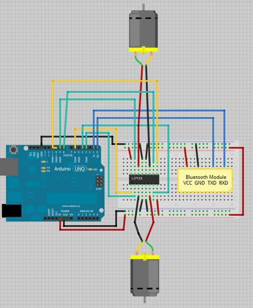

# RC Boat Board

It is time to build the circuit for the Bluetooth remote-controlled boat!

## Circuit

The circuit that we are going to build is rather complex and is nothing in comparison with simple circuits we have been building so far. With that, we are going to give you the circuit diagram that you can reconstruct without understanding all the details.



Note that the yellow wire goes into the pin 11, not pin 10. In addition, the bluetooth module that we are going to use (HC-06) can have a different placement of pins from the one depicted on the diagram.

## Code

We are going to present an __incomplete version__ of the code for your Arduino. It already implements functionality such that spinning motors to go forward or to turn to one side. Your job is to __finish the TODO blocks__ (there are 3 of them) to make the board fully functional.

```c++
/*
 * Based on a tutorial by Rui Santos, http://randomnerdtutorials.com
 * Control 2 DC motors with Smartphone via bluetooth
 * 2013
 */
int motor1Pin1 = 3; // pin 2 on L293D IC
int motor1Pin2 = 4; // pin 7 on L293D IC
int enable1Pin = 6; // pin 1 on L293D IC
int motor2Pin1 = 8; // pin 10 on L293D IC
int motor2Pin2 = 9; // pin 15 on L293D IC
int enable2Pin = 11; // pin 9 on L293D IC
int state;
int flag=0;        //makes sure that the serial only prints once the state
int stateStop=0;
void setup() {
    // sets the pins as outputs:
    pinMode(motor1Pin1, OUTPUT);
    pinMode(motor1Pin2, OUTPUT);
    pinMode(enable1Pin, OUTPUT);
    pinMode(motor2Pin1, OUTPUT);
    pinMode(motor2Pin2, OUTPUT);
    pinMode(enable2Pin, OUTPUT);
    // sets enable1Pin and enable2Pin high so that motor can turn on:
    digitalWrite(enable1Pin, HIGH);
    digitalWrite(enable2Pin, HIGH);
    // initialize serial communication at 9600 bits per second:
    Serial.begin(9600);
}

void loop() {
    //if some date is sent, reads it and saves in state
    if(Serial.available() > 0){     
      state = Serial.read();   
    }   
    // if the state is '1' the DC motor will go forward
    if (state == '1') {
        digitalWrite(motor1Pin1, HIGH);
        digitalWrite(motor1Pin2, LOW); 
        digitalWrite(motor2Pin1, LOW);
        digitalWrite(motor2Pin2, HIGH);
    }
    // if the state is '2' the motor will turn left
    else if (state == '2') {
        digitalWrite(motor1Pin1, HIGH); 
        digitalWrite(motor1Pin2, LOW); 
        digitalWrite(motor2Pin1, LOW);
        digitalWrite(motor2Pin2, LOW);
    }
    // if the state is '3' the motor will Stop
    else if (state == '3') {
        // TODO: What happens when you want to stop?
        // WRITE YOUR CODE HERE

        
    }
    // if the state is '4' the motor will turn right
    else if (state == '4') {
        // TODO: What happens when you want to go right?
        // WRITE YOUR CODE HERE

        
    }
    // if the state is '5' the motor will Reverse
    else if (state == '5') {
        // TODO: What happens when you want to go backwards?
        // WRITE YOUR CODE HERE

        
    }
    //For debugging purpose
    Serial.println(state);
}
```

